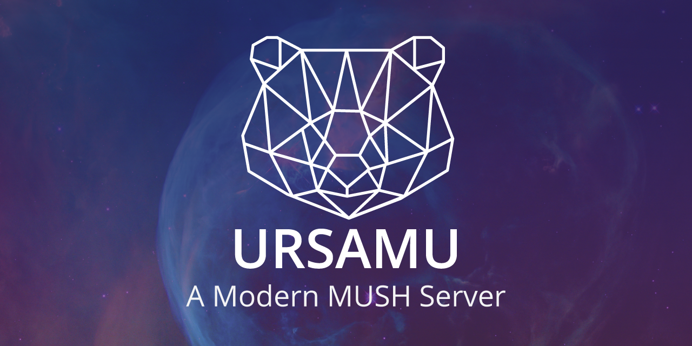

# UrsaMU

### The Modern MUSH-Like Server



## What is UrsaMU?

UrsaMU is a modern MUSH-like server written in TypeScript and powered by Deno. It provides a flexible, extensible platform for creating text-based, multi-user virtual environments with a focus on performance, modularity, and developer experience.

## Architecture

UrsaMU uses a microservices architecture with independent processes:

### Core Services

- **Main Server**: Handles the core game logic, database operations, web API endpoints, Socket.IO connections, and plugin management.
- **Telnet Server**: Runs as a separate process to handle telnet connections, allowing it to restart independently from the main server.

### Database Services

UrsaMU uses Deno KV for efficient data storage, with multiple databases for different game aspects:
- Main database (data/ursamu.db)
- Counters (data/counters.db)
- Channels (data/chans.db)
- Mail system (data/mail.db)
- Bulletin boards (data/bboard.db)

### Network Services

- **Telnet**: Port 4201 - Classic MU* connection
- **Socket.IO**: Port 4202 - Modern web clients with real-time bidirectional communication
- **HTTP API**: Port 4203 - RESTful API and web interface

## Using UrsaMU

UrsaMU can be used in three ways:

1. **As a standalone server**: Run UrsaMU as a complete server and connect via telnet or web client.
2. **As a library**: Use UrsaMU as a library to build your own custom MU* game.
3. **As a plugin platform**: Create plugins to extend UrsaMU's functionality.

For information on using UrsaMU as a library, see [README-LIB.md](README-LIB.md).
For information on using the UrsaMU CLI, see [README-CLI.md](README-CLI.md).

## Quick Start

### Installation

```bash
# Clone the repository
git clone https://github.com/ursanu/ursamu.git
cd ursamu

# Set up configuration
deno task setup-config
```

### Starting the Server

UrsaMU now uses a dual-server architecture with watch mode for development:

```bash
# Start both main and telnet servers with watch mode
deno task start
```

This will:
- Start both the main server and telnet server as separate processes
- Enable watch mode for automatic reloading when files change
- Allow each server to restart independently

For development with individual servers:

```bash
# Main server only with watch mode
deno task dev

# Telnet server only with watch mode
deno task telnet
```

### Connecting

Connect to your UrsaMU server using:
- **Telnet Client**: `telnet localhost 4201`
- **Web Client**: http://localhost:4203 (if you build a web interface)
- **Socket.IO Client**: Connect to `http://localhost:4202` from custom clients using the Socket.IO client library

## Creating a New UrsaMU Project

UrsaMU provides a CLI tool for creating new projects:

```bash
# Install the UrsaMU CLI
deno install -A -n ursamu https://deno.land/x/ursamu/src/cli/ursamu.ts

# Create a new project
ursamu create my-game
cd my-game

# Start the servers
deno task start
```

This creates a new project with the dual-server architecture and watch mode already configured.

## Configuration

UrsaMU uses a flexible configuration system stored in JSON format:

```bash
# Show the entire configuration
deno task config

# Get a specific configuration value
deno task config --get server.ws

# Set a configuration value
deno task config --set server.ws 4202
```

The configuration is stored in `config/config.json` and includes:
- Server ports and database paths
- Game name, description, and version
- Text file locations
- Plugin settings

## Plugins

### Creating a Plugin

```bash
# Create a new plugin
deno task create-plugin my-plugin
```

This creates a new plugin with:
- Basic structure implementing the `IPlugin` interface
- Configuration support
- Separate main and telnet server files
- A run script for the dual-server architecture with watch mode

### Plugin Structure

```
src/plugins/my-plugin/
├── index.ts           # Main plugin file
├── scripts/           # Utility scripts
│   └── run.sh         # Script to run both servers
└── src/               # Source code
    ├── main.ts        # Main server entry point
    └── telnet.ts      # Telnet server entry point
```

## Telnet Server

UrsaMU now provides a telnet server that runs as a separate process, allowing it to restart independently from the main server. This improves stability and development experience.

To use the telnet server in a child project:

```typescript
import { startTelnetServer } from "ursamu";

// Start the telnet server with default options
startTelnetServer();

// Or with custom options
startTelnetServer({
  port: 4201,                     // Custom port
  welcomeFile: "text/default_connect.txt" // Custom welcome file
});
```

## Socket.IO Integration

UrsaMU uses Socket.IO for real-time bidirectional communication with web clients. This provides a more robust and feature-rich alternative to plain WebSockets, with benefits like:

- Automatic reconnection
- Room-based messaging
- Fallback to long-polling when WebSockets aren't available
- Built-in event system

To connect from a client:

```javascript
// Using the Socket.IO client library
import { io } from "socket.io-client";

const socket = io("http://localhost:4202");

socket.on("connect", () => {
  console.log("Connected to UrsaMU server");
});

socket.on("output", (data) => {
  console.log("Received output:", data);
});

// Send a command to the server
socket.emit("command", "look");
```

## Docker

```bash
git clone https://github.com/lcanady/ursamu.git
cd ursamu
docker-compose up -d
```

The game databases will be exported to the `data/` directory, and configuration will be stored in the `config/` directory.

## Documentation

For more information about UrsaMU:
- [UrsaMU Website](https://ursamu.io)
- [UrsaMU Documentation](https://docs.ursamu.io)

## License

UrsaMU is licensed under the MIT License.

## Contributing

Pull requests are welcome. For major changes, please open an issue first to discuss what you would like to change.
